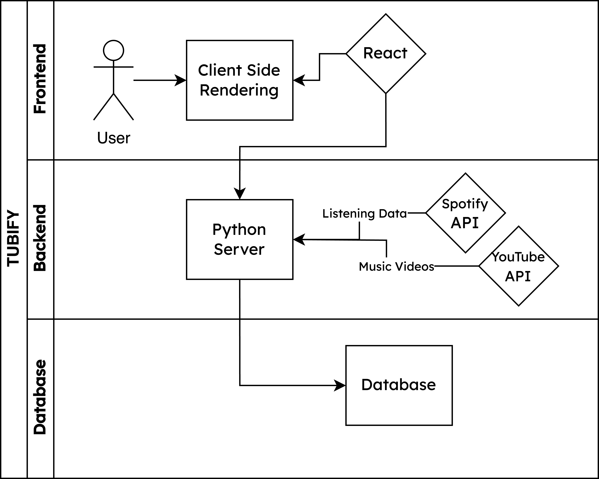

# Tubify Design Document

## System Description

### System Overview

- Our system integrates the Spotify and YouTube APIs on a single webpage to add functionality to Spotify.
- Some of these include identifying music that a user and their friends have both liked on Spotify, recommending songs to the user that the user's friends have liked, and creating a queue of music videos from your Spotify library and playing them with the YouTube API.

### Core Functionalities

- **Spotify Integration**: Connect to Spotify to access user's library and listening history.
- **Similarity Detection**: Algorithm that detects common songs, artists, albums, genres, etc between friends.
- **Playlist Creation**: Generate a playlist of music videos from your Spotify library.
- **Recommendation System**: Recommend songs that may appeal to the user based on their listening history and the songs their friends have liked.
- **Queue Creation**: Create a queue of music videos from your recommendations.
- **Video Player**: Play the music videos on the platform.

## Architectural Overview

### System Architecture

- The system design is based on the Model-View-Controller (MVC) and microservices architecture.
- A web frontend is built with React.js, a backend API is built with FastAPI on Python to handle any data-related operations.
- The backend will interact with the Spotify and YouTube APIs to fetch data.
- The backend will also interact with the database to store and retrieve data.

### System Components

- **Frontend**: A web application built with React.js that allows users to interact with the system.
- **Backend**: A FastAPI application that handles data-related operations.
- **Database**: A PostgreSQL database that stores user data and preferences.
- **Spotify API**: An API that allows the backend to interact with Spotify.
- **YouTube API**: An API that allows the backend to interact with YouTube.

### System Diagram

## Functional Requirements

### Epics

| Epic 1: Account/Data Management                                                                                                   |
| --------------------------------------------------------------------------------------------------------------------------------- |
| **As a** user of Tubify                                                                                                           |
| **I want** to be able to change my account preferences, sign in/out, and retrieve my data and other public data from the platform |
| **So that** I can cater the application to my preferences                                                                         |

| Epic 2: API Connections                                                                                                         |
| ------------------------------------------------------------------------------------------------------------------------------- |
| **As a** user of Tubify                                                                                                         |
| **I want** Tubify to have access to the APIs of Spotify and YouTube                                                             |
| **So that** I can retrieve, store, and use my data from my Spotify listening history to watch music videos sourced from YouTube |

| Epic 3: Friend System                                                          |
| ------------------------------------------------------------------------------ |
| **As a** user of Tubify                                                        |
| **I want** to be able to see my friends and their listening trends and history |
| **So that** I can see how our trends relate and discover new music.            |

| Epic 4: Recommendation System                                                                 |
| --------------------------------------------------------------------------------------------- |
| **As a** user of Tubify                                                                       |
| **I want** to be able to see recommendations based on my listening history and friends trends |
| **So that** I can discover new music.                                                         |

| Epic 5: Playlist Generation Algorithm                                                |
| ------------------------------------------------------------------------------------ |
| **As a** user of Tubify                                                              |
| **I want** to be able to generate a playlist of music videos from my Spotify library |
| **So that** I can share the playlist with my friends.                                |

## Non-Functional Requirements

### Security Requirements

- User data is stored in a secure database.
- User data is encrypted at rest.

### Performance Requirements

- The system should be able to handle a large number of requests, users, playlists, and recommendations.
- Videos should be played with low latency.
- Pages should load in under 3 seconds.

### Usability Requirements

- The system should be easy to use and navigate.
- The system should be responsive and have a clean design.

## Technologies & Frameworks

### Programming Languages

- JavaScript
- Python
- HTML/CSS

### Frameworks

- React
- FastAPI
- PostgreSQL
- Tailwind CSS
- Material-UI

### APIs

- Spotify API
- YouTube API

## Minimum Viable Product

- Landing Page

  - Buttons that lead to different pages (profile, search, friends, playlists, etc)
  - If not logged in, show sign in and sign up buttons
  - If logged in show page links and sign out button
  - User Stories: **US1 (Other user stories will add to the landing page as well as other functionality)**

- Account Services

  - Sign in/out and link account to Spotify and Youtube accounts
  - Allow users to adjust their profiles and preferences
  - Show data visualizations of recently listened to songs, artists, albums, etc.
  - User Stories: **US2, US3, US4, US5, US8, US13, US15**

- Playlist Services

  - Allow users to create playlists and add songs to them
  - Generate playlists based on user's listening history and Spotify playlists
  - Users can play a playlist of music videos on the platform
  - User Stories: **US6, US7, US12, US16**

- Friend Services
  - Allow users to add friends and see their listening history, top artists, top songs, etc.
  - Search for users, songs, albums, playlists, etc.
    - On search of songs, albums, and artists display what songs you and/or your friends have liked
  - User Stories: **US9, US10, US11, US14**

### Additional Features Past MVP

- Recommendation Services
  - Allow users to see recommendations based on their listening history and friends' listening history
  - Users can access a queue of recommendations via music videos displayed in a Tinder-like swiping interface
  - User Stories: **US17, US18, US19**

## Preliminary Roadmap

## Sprint 1

- User Account Logic
  - Database schema **implemented**
  - Sign in/out **implemented**
  - Account integrations (Spotify, Youtube) **implemented**
- Landing page **implemented**
- User Profile Page **started**

## Sprint 2

- Playlist Creation Page **implemented**
- User Profile Page **finished**
- Search Page **implemented**
- Friends Services **implemented**

## Sprint 3

- Video Player **implemented**
- Recommendation System **started**
- Website Styling **started**

## Sprint 4

- Recommendation System **continued**
- Website Styling **continued**
- Polish platform
  - Additional Features
  - Bug Squashing

## Sprint 5

- Recommendation System **finished**
- Website Styling **finished**
- Polish platform
  - Additional Features
  - Bug Squashing

## Sprint 6

- Finalize platform
  - Additional Features
  - Bug Squashing
